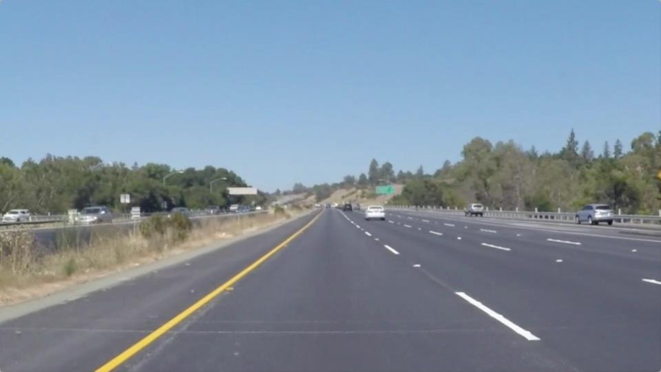
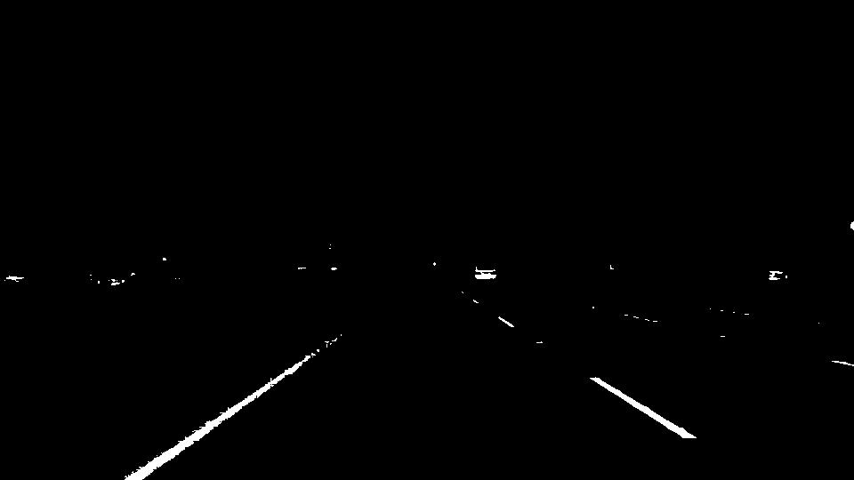
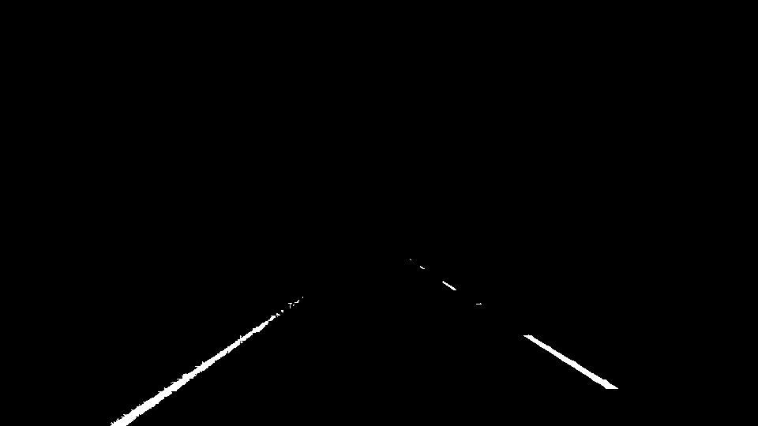
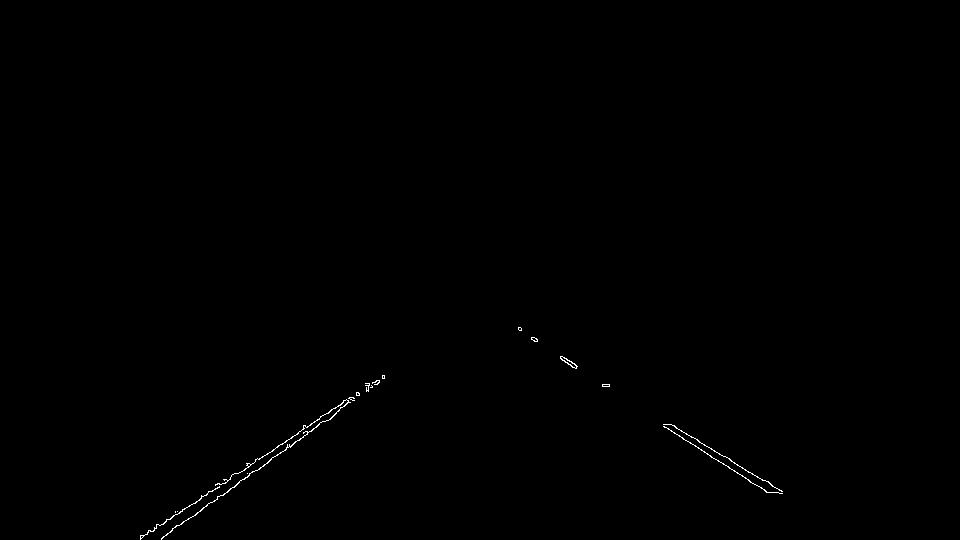
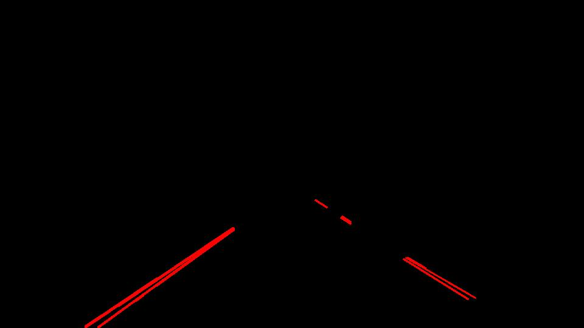
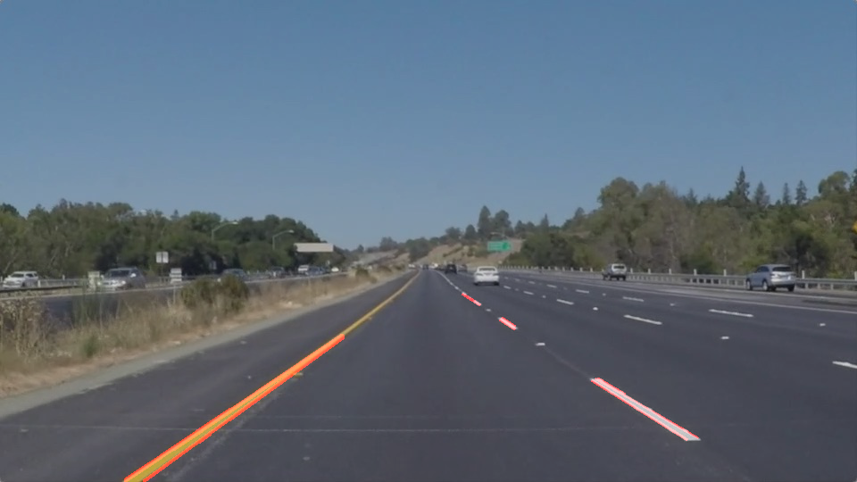

### Omar benzakour
---

# **Finding Lane Lines on the Road** 

##Overview

When we drive, we use our eyes to decide where to go.  The lines on the road that show us where the lanes are act as our constant reference for where to steer the vehicle.  Naturally, one of the first things we would like to do in developing a self-driving car is to automatically detect lane lines using an algorithm.

In this project we will detect lane lines in images using Python and OpenCV.  OpenCV means "Open-Source Computer Vision", which is a package that has many useful tools for analyzing images.  

## Set up

the required packages can be installed following the [CarND Term1 Starter Kit](https://classroom.udacity.com/nanodegrees/nd013/parts/fbf77062-5703-404e-b60c-95b78b2f3f9e/modules/83ec35ee-1e02-48a5-bdb7-d244bd47c2dc/lessons/8c82408b-a217-4d09-b81d-1bda4c6380ef/concepts/4f1870e0-3849-43e4-b670-12e6f2d4b7a7)

## Pipeline description

### Original image

After the analysis of the different videos and images, we can see that the lanes are either yellow or white (to stand out from the color of the road) from this observation we can split the pipeline into these steps:

	
	<figcaption>Original image</figcaption>

### 1) Color filter

We select the pixels which color range between white and yellow. The RGB color model is not the most convenient one because it doesn't allow us to simply select the different variations of a color, HSV color model is better suited for this. The first step is therefore to convert the image's RGB color into HSV colors and apply to it a color filter

	
	<figcaption>Applying a color filter</figcaption>

### 2) Keeping only the region of interest

We apply to a mask to keep the focus on a geographical region of interest, thus we can discard the other lines, white neighboring cars ...

	
	<figcaption>Keeping the region of interest</figcaption>

### 3) Canny edge detection

Next, we apply a Gaussian noise to the image to avoid detecting irrelevant and small contours. Then, we apply the canny edge detection in order to obtain the contours of the image

	
	<figcaption>Applying the canny edge detection</figcaption>

### 4) Hough Transform

We apply the Hough transform to this image to obtain several lines characterized by 2 points, we then draw them in red. To see the results, we will overlap the line that we have found with the original image

	
	<figcaption>Applying the hough transform</figcaption>

	
	<figcaption>Overlap with the original image</figcaption>

### 5) Discarding invalid lines

For all the lines that we have found thanks to the Hough transform:

1. We discard all the lines that have a small slope
2. Based on the sign of the slope, we split the lines into the ones that are at the left and the ones that are on the right of the image
3. We compute the intersection of the line with the y=0,6(vertical_size_of_image) and with the line y =vertical_size_of_image
4. We then take the average of the points located at the upper left, upper right, lower right and lower left of the images and draw the two resulting lines
5. In the case of a video, I have noticed that the lines are not stable. I have therefore saved the 4 points of the previous image and took for each point the weighted barycenter of the old point with the new one.

## Potential shortcomings of the current pipeline

1. This pipeline works best for finding lanes that are lines.That is not always  the case (roundabouts, turns...)
2. This algorithm relies too much on geometry and colors, we will have a lot of false negatives if a white car is right in front of ours.
3. The region of interest is hardcoded
4. I wonder if my color filters are well suited for other types of roads (dusty roads, rainy roads, roads with mirages.)

## Possible improvements to the pipeline

A possible improvement would be to be able to distinguish cars. Thus, we can discard the most common source of white or yellow noise.
In my pipeline, I just take a barycenter of the points of intersections. A linear regression of the points that comes out of the Hough transform would have been better

